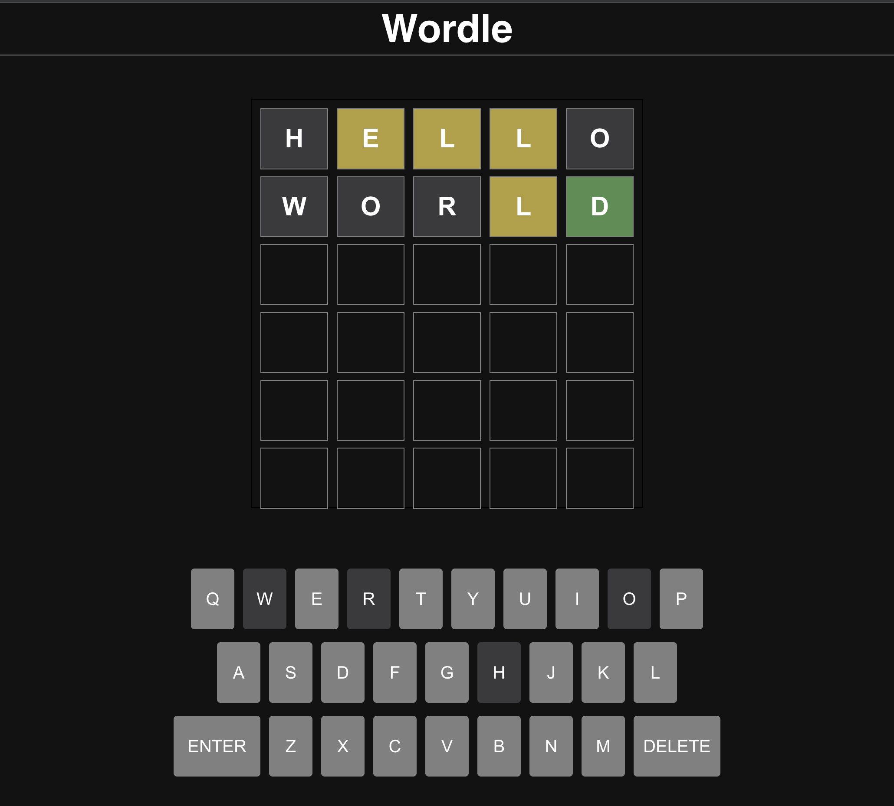

# Wordle Game

Wordle Game is a word guessing game built with React and Vite.



Wanna play? Visit this link: [Game Link](https://tarek-wordle-clone.netlify.app/)

## Table of Contents

- [About](#about)
- [Getting Started](#getting-started)
  - [Installation](#installation)
  - [Available Scripts](#available-scripts)
- [Dependencies](#dependencies)
- [Dev Dependencies](#dev-dependencies)
- [Contributing](#contributing)
- [License](#license)

## About

Wordle is a word guessing game that challenges players to guess a hidden word within a limited number of attempts. It's built using React and Vite, leveraging modern technologies to create an engaging and interactive gaming experience.

## Getting Started

### Installation

1. Clone the repository:

   ```sh
   git clone https://github.com/tarektarho/Wordle-clone.git
   ```

2. Navigate to the project directory:

   ```sh
   cd wordle
   ```

3. Install dependencies:

   ```sh
   npm install
   ```

### Available Scripts

In the project directory, you can run the following scripts:

- **Development Server:**

  ```sh
  npm run dev
  ```

  Runs the development server using Vite.

- **Build:**

  ```sh
  npm run build
  ```

  Builds the production-ready assets using Vite.

- **Linting:**

  ```sh
  npm run lint
  ```

  Lints the project files using ESLint.

- **Preview Build:**
  ```sh
  npm run preview
  ```
  Previews the production build using Vite.

## Dependencies

- `react`: ^18.2.0
- `react-dom`: ^18.2.0

## Dev Dependencies

- `@testing-library/react`: ^14.0.0
- `@types/react`: ^18.2.15
- `@types/react-dom`: ^18.2.7
- `@vitejs/plugin-react`: ^4.0.3
- `eslint`: ^8.45.0
- `eslint-plugin-react`: ^7.32.2
- `eslint-plugin-react-hooks`: ^4.6.0
- `eslint-plugin-react-refresh`: ^0.4.3
- `vite`: ^4.4.5

## Contributing

Contributions are welcome! If you find bugs, have suggestions, or want to contribute in any way, please feel free to create issues or pull requests in the GitHub repository.

1. Fork the repository.
2. Create a new branch: `git checkout -b feature/your-feature-name`
3. Commit your changes: `git commit -am 'Add some feature'`
4. Push to the branch: `git push origin feature/your-feature-name`
5. Create a pull request.

Please refer to the [Contributing Guidelines](CONTRIBUTING.md) for more details.

## License

This project is licensed under the [MIT License](LICENSE).
